# eufx
_/yo͞o fəks/_

## Install and build
1. `git clone https://github.com/joshnatis/eufx.git`
2. `make`

## Usage
`./eufx --filter <filter_type> input.pgm output.pgm`

* Sample images to operate on are in the `images/` directory

* The PGM files must be uncompressed (_eufx: yeah! i can't parse bullshidt_ ):<
  * To get an uncompressed PGM file, scour the interwebz for one, or use some sort of utility to convert images to PGM format.
  * Most of them compress the images to shit, so they won't work.
  * Use ImageMagick's `convert` utility: `convert -compress none input.pgm output.pgm`
  
_eufx: put me in your PATH! let's be friends :D_
  
## Available Filters
* reflect
* rotate
* asciify
* scale_down
* scale_up
* noise
* posterize
* nothing
* invert
* frame
* box_blur
* gaussian_blur
* motion_blur
* sobol_edge_detection
* horizontal_edge_detection
* vertical_edge_detection
* 45_edge_detection
* all_edge_detection
* edge_detection_2
* sharpen1
* sharpen2
* deepfry
* gridlines
* emboss
* acid
* soundscape

## Pictures!

Originals:


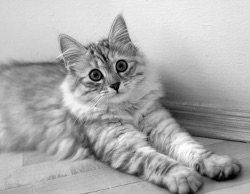


Filtered:

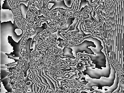
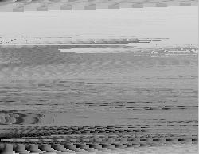
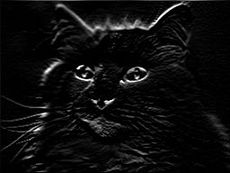
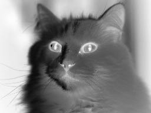
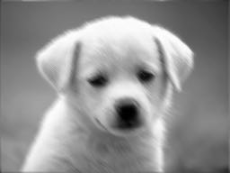
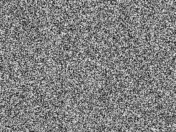
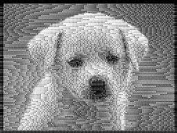
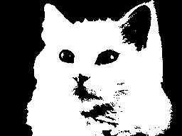
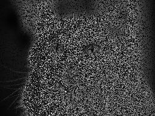
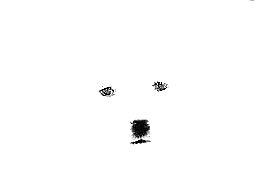
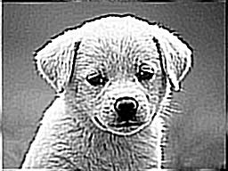
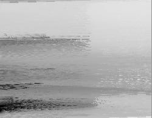


## Background Information
The PGM (Portable Graymap) format is an image format (like JPG or PNG). PGM formatted images only support black-and-white (there's no way to encode color), and they're not compressed at all, which makes them very easy to parse and work with (not to mention _thicc_). A PGM image is essentially a matrix of pixels, each of which being a value representing how light/dark it is. The images begin with some header information, noteably the specifications of the height and width, as well as the maximum gray value (i.e. what value constitutes as white). This last point means you can have an arbitrary number of shades of gray in your image, which is pretty cool (_well, actually the largest allowed maximum gray value is 65536_).

A nice, succint specification of PGM images lives [here](http://netpbm.sourceforge.net/doc/pgm.html).

## Sources

* https://lodev.org/cgtutor/
  * Lode's filter tutorials were very helpful. I pretty much used his filter algorithms and adjusted them to fit within my program -- he's using SDL and actual colored images, so I had to do some fidgeting.
  
* https://maryash.github.io/135/labs/lab_08.html

## All Your ASCII Cade Are Belong To Us
```
#################****##############################*****########
################******############################******########
################******##########################*********#######
###############*******#########################****#*****#######
###########*####******######################******###****#######
############*##********#####################*****####****#######
###########**##********#######*####*##*####*.*****###****#######
############*#***********#####*###***#*****.******###****#######
##############********************..**.***.*******###****#######
#############*******************.****************####*****######
###############*.****.........**..****************###*****######
###############*.***.......*..*.*******************#******######
###############*****.........*****************####********######
###############****..........***.*************#####*******######
###############***..........********************##*#******######
###############***.........*******************************######
###############***.......*********************************######
###############**.....************************************######
###############*.....*###*************###*****************######
##############*.....**.###**********######****************######
#############*......*#*##**..******##*#**#****************######
#############.......***#*#*...*****#**#*#*****************######
############*.......*******.******###*********************######
############*.......******..******************************######
############*........****...******************************######
############*.........*.....******************************######
############*..............********************************#####
############*............*********************************######
#############*.....*.....**#*##****************************#####
#############*...***....****##*****************************#####
#############*....**....****#******************************#####
#############*....**..******#******************************#####
############*.....***..****###*****************************#####
############*.....****..****###*****************************####
###########**.....****...******###**************************####
###########*.....*******..***********************************###
##########**......*******...*********************************###
##########*.......********..**********************************##
##########*.......*********.**********************************##
##########**......*********************************************#
##########*.......*********************************************#
##########*.......*********************************************#
#########**........********************************************#
#########***........********************************************
##########***.......********************************************
###########**.........*****************************************#
###########**........*******************************************
###########**........*****************#*************************
```
